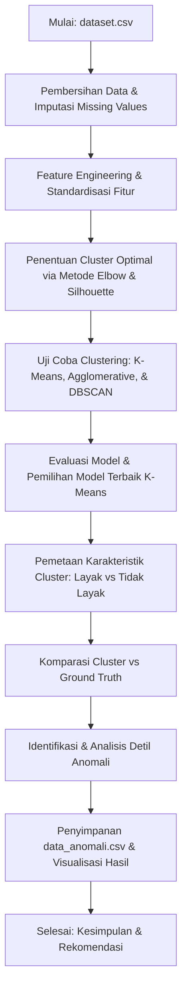

# Analisis Kesesuaian Penerima Beasiswa Menggunakan Metode Clustering Terhadap Data Ground Truth

Proyek ini bertujuan untuk menganalisis kesesuaian dan objektivitas penerimaan beasiswa dengan membandingkan hasil keputusan historis (*Ground Truth*) terhadap pengelompokan pendaftar secara objektif menggunakan metode *Clustering* (pembelajaran tanpa pengawasan / *Unsupervised Learning*). Analisis ini membantu mengidentifikasi anomali keputusan seleksi berupa kasus "Salah Terima" (pendaftar yang secara data profil kurang layak namun diterima) dan "Salah Tolak" (pendaftar yang secara data profil layak namun ditolak).

---

## 📌 Alur Kerja Proyek (Workflow)



---

## 📂 Struktur Repositori

*   [analisis_beasiswa.ipynb](file:///C:/Users/f0ursecond/Documents/machinelearning/analisis_beasiswa.ipynb): Jupyter Notebook utama yang berisi seluruh kode analisis data, pemodelan *clustering*, evaluasi, dan visualisasi.
*   [dataset.csv](file:///C:/Users/f0ursecond/Documents/machinelearning/dataset.csv): Dataset mentah berisi data pendaftar beasiswa (1.043 data pendaftar beasiswa dengan 15 fitur setelah pembersihan).
*   [data_anomali.csv](file:///C:/Users/f0ursecond/Documents/machinelearning/data_anomali.csv): Hasil ekstraksi data pendaftar yang teridentifikasi mengalami anomali keputusan seleksi.
*   [requirements.txt](file:///C:/Users/f0ursecond/Documents/machinelearning/requirements.txt): Daftar *library* Python yang dibutuhkan untuk menjalankan proyek ini.
*   **Visualisasi Grafis (.png):**
    *   [elbow_method.png](file:///C:/Users/f0ursecond/Documents/machinelearning/elbow_method.png): Grafik WCSS dan Silhouette Score untuk pemilihan nilai $k$ optimal.
    *   [confusion_matrix.png](file:///C:/Users/f0ursecond/Documents/machinelearning/confusion_matrix.png): Matriks kebingungan (confusion matrix) untuk K-Means dan Agglomerative Clustering.
    *   [visualisasi_anomali.png](file:///C:/Users/f0ursecond/Documents/machinelearning/visualisasi_anomali.png): Grafik distribusi tipe anomali, perbandingan jumlah, sebaran IPK, dan penghasilan pada data anomali.
    *   [heatmap_korelasi.png](file:///C:/Users/f0ursecond/Documents/machinelearning/heatmap_korelasi.png): Matriks korelasi antar fitur numerik dan kategorikal ter-encode.
    *   [boxplot_perbandingan.png](file:///C:/Users/f0ursecond/Documents/machinelearning/boxplot_perbandingan.png): Boxplot sebaran fitur (IPK, Tanggungan, SKS, dll.) per kategori keputusan beasiswa.
    *   [scatter_ipk_penghasilan.png](file:///C:/Users/f0ursecond/Documents/machinelearning/scatter_ipk_penghasilan.png): Scatter plot korelasi IPK dan Penghasilan Orang Tua berdasarkan kategori kesesuaian seleksi.

---

## 🛠️ Tahapan Analisis & Metode

### 1. Data Preprocessing & Cleaning
*   **Pembersihan Kolom:** Menghapus kolom kosong bawaan (`Unnamed: 15` hingga `Unnamed: 25`).
*   **Pembersihan Spasi:** Melakukan strip whitespace pada nama kolom dan nilai teks.
*   **Imputasi Nilai Kosong:** Mengisi data numerik yang kosong dengan nilai *median* dan data kategorikal dengan nilai *mode* (modus).
*   **Pemisahan Label:** Memisahkan kolom `Status Beasiswa` menjadi target terpisah `Ground_Truth` (1 untuk 'Terima', 0 untuk 'Tidak').
*   **Fitur Clustering:** Menggunakan 10 fitur seleksi:
    `['Jenis Kelamin', 'Jarak Tempat Tinggal kekampus (Km)', 'Tahun Lulus', 'SKS', 'Ikut Organisasi', 'Ikut UKM', 'IPK', 'Pekerjaan Orang Tua', 'Penghasilan', 'Tanggungan']`
*   **Encoding & Scaling:** Menggunakan `LabelEncoder` untuk fitur kategorikal dan `StandardScaler` untuk standardisasi seluruh fitur agar memiliki skala rata-rata 0 dan variansi 1.

### 2. Penentuan Jumlah Cluster Optimal ($k$)
Berdasarkan pengujian nilai $k$ dari 2 hingga 10 menggunakan *Elbow Method* (WCSS) dan *Silhouette Score*, didapatkan bahwa **$k=2$** adalah jumlah cluster paling optimal karena menghasilkan Silhouette Score tertinggi (0.1878) dan secara logis sangat cocok dengan pembagian klasifikasi biner beasiswa (Layak vs Tidak Layak).

### 3. Eksperimen Pemodelan Clustering
Tiga metode *clustering* diuji untuk membandingkan performa:

| Metode Clustering | Silhouette Score | Davies-Bouldin Index | Keterangan |
| :--- | :---: | :---: | :--- |
| **K-Means ($k=2$)** | **0.1878** | **2.1339** | **Model Terbaik (Dipilih)** |
| **Agglomerative ($k=2$)** | 0.1381 | 2.3658 | Performa di bawah K-Means |
| **DBSCAN (eps=2.5, min=5)** | N/A | - | Terlalu sensitif (1 cluster dominan & 11 noise) |

> [!NOTE]
> K-Means dipilih sebagai model analisis utama karena memiliki struktur pemisahan klaster yang paling solid dibandingkan metode lainnya.

### 4. Komparasi Hasil & Pemetaan Kelayakan
Berdasarkan analisis karakteristik rata-rata fitur pada cluster yang terbentuk melalui K-Means:
*   **Cluster 0 (LAYAK):** Memiliki rata-rata IPK tinggi (3.32), persentase penghasilan rendah yang lebih tinggi (33.25%), dan rata-rata tanggungan orang tua yang lebih banyak (3.16 anak).
*   **Cluster 1 (TIDAK LAYAK):** Memiliki rata-rata IPK relatif sama (3.31), namun tingkat ekonomi lebih mapan (persentase penghasilan rendah hanya 20.48%) dan rata-rata tanggungan lebih sedikit (2.20 anak).

Berikut adalah matriks komparasi hasil pembagian cluster K-Means terhadap keputusan aktual (*Ground Truth*):

| Kategori Analisis | K-Means: Cluster 0 (Layak) | K-Means: Cluster 1 (Tidak Layak) | Total |
| :--- | :---: | :---: | :---: |
| **Ground Truth: Terima Beasiswa** | **202** (Benar: Terima) | **70** (Salah Terima / Anomali 1) | **272** |
| **Ground Truth: Tidak Terima** | **216** (Salah Tolak / Anomali 2) | **555** (Benar: Tolak) | **771** |
| **Total** | **418** | **625** | **1.043** |

---

## ⚠️ Analisis Data Anomali

Ditemukan sebanyak **286 data anomali (27.4%)** dari total 1.043 pendaftar yang menunjukkan adanya ketidaksesuaian keputusan seleksi manual dibanding profil objektif pendaftar:

### 🔴 Anomali 'Salah Terima' (70 Pendaftar)
Adalah pendaftar yang lolos beasiswa (GT: Terima), namun secara profil clustering masuk kategori **Tidak Layak**.
*   **Karakteristik:** Rata-rata IPK 3.51 (sangat tinggi), namun tingkat ekonominya tergolong menengah ke atas (didominasi penghasilan Sedang & Tinggi) dengan rata-rata jumlah tanggungan yang kecil (2.6 anak). Pendaftar ini kemungkinan besar lolos karena keunggulan akademik yang sangat menonjol, mengabaikan aspek finansial.

### 🟣 Anomali 'Salah Tolak' (216 Pendaftar)
Adalah pendaftar yang tidak lolos seleksi beasiswa (GT: Tidak), namun secara profil clustering masuk kategori **Layak**.
*   **Karakteristik:** Rata-rata IPK berada di batas aman 3.30, namun kondisi ekonominya sangat membutuhkan bantuan (didominasi tingkat penghasilan Rendah & Sedang) serta memiliki beban tanggungan keluarga yang lebih berat (rata-rata 3.1 anak). Pendaftar ini merupakan target sasaran beasiswa yang terlewatkan (misclassified).

---

## 📈 Kesimpulan & Rekomendasi

### Kesimpulan Utama
1.  Metode *clustering* berhasil memetakan profil kelayakan penerima beasiswa secara objektif berdasarkan gabungan nilai akademik dan kondisi ekonomi.
2.  Tingkat ketidaksesuaian (*mismatch rate*) keputusan seleksi manual mencapai **27.4% (286 orang)**. Hal ini menunjukkan indikasi kuat perlunya peninjauan kembali sistem pembobotan kriteria seleksi yang berjalan saat ini.

### Rekomendasi Sistemik
*   **Formulasi Kriteria:** Lakukan penyeimbangan bobot seleksi agar prestasi akademik (IPK) dan kemiskinan (Penghasilan & Tanggungan) dinilai secara proporsional.
*   **Sistem Pendukung Keputusan (DSS):** Integrasikan pemodelan berbasis data (seperti K-Means) ke dalam sistem penyaringan awal untuk mengurangi subjektivitas manusia.
*   **Audit Berkala:** Gunakan dataset hasil klasterisasi ini untuk melakukan *cross-check* atau verifikasi lapangan secara acak pada kelompok pendaftar yang terdeteksi anomali.

---

## 🚀 Cara Menjalankan Proyek

1.  Clone atau pastikan Anda berada di direktori project `machinelearning`.
2.  Install pustaka pendukung melalui pip:
    ```bash
    pip install -r requirements.txt
    ```
3.  Jalankan Jupyter Notebook:
    ```bash
    jupyter notebook analisis_beasiswa.ipynb
    ```
4.  Eksekusi seluruh cell notebook untuk menghasilkan kembali grafik-grafik analisis dan file [data_anomali.csv](file:///C:/Users/f0ursecond/Documents/machinelearning/data_anomali.csv).
# TA-MachineLearning
