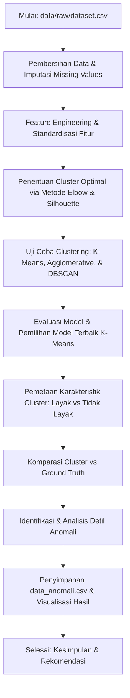

# Analisis Kesesuaian Penerima Beasiswa Menggunakan Metode Clustering Terhadap Data Ground Truth
Proyek akhir (*Capstone Project*) untuk Mata Kuliah Pembelajaran Mesin. Proyek ini bertujuan untuk menganalisis kesesuaian dan objektivitas penerimaan beasiswa dengan membandingkan hasil keputusan historis (*Ground Truth*) terhadap pengelompokan pendaftar secara objektif menggunakan metode *Clustering* (*Unsupervised Learning*).

Analisis ini membantu mengidentifikasi anomali keputusan seleksi berupa kasus:
1. **Salah Terima:** Pendaftar yang secara data profil sosio-ekonomi tergolong mampu, namun dinyatakan diterima beasiswa karena faktor keunggulan akademik (IPK) yang sangat menonjol.
2. **Salah Tolak:** Pendaftar yang secara data profil sosio-ekonomi sangat layak dibantu (penghasilan rendah & tanggungan banyak) dan memenuhi syarat batas aman akademik, namun dinyatakan ditolak.

---

## 📌 Alur Kerja Proyek (Workflow)



---

## 📂 Struktur Repositori
Repositori disusun berdasarkan template standar Capstone Project Data Mining:
```
capstone-project-data-mining/
│
├── data/
│   ├── raw/
│   │   └── dataset.csv                 # Dataset mentah asli pendaftar beasiswa
│   └── processed/
│       └── data_anomali.csv            # Hasil ekstraksi pendaftar terindikasi anomali
│
├── notebooks/
│   ├── 01_eda.ipynb                    # Notebook EDA dan Preprocessing
│   ├── 02_modeling.ipynb               # Notebook Pemodelan dan Evaluasi
│   ├── 03_interpretation.ipynb         # Notebook Interpretasi Model & Anomali
│   └── analisis_beasiswa.ipynb         # Notebook lengkap (gabungan)
│
├── src/
│   ├── data_preprocessing.py           # Modul pembersihan data & preprocessing
│   ├── train_model.py                  # Pipeline pelatihan model utama
│   ├── evaluate_model.py               # Modul evaluasi performa model & crosstab
│   └── utils.py                        # Modul pembuatan direktori & plotting
│
├── models/
│   ├── best_model.pkl                  # Model K-Means terbaik (Pickle)
│   └── preprocessing.pkl               # Pipeline scaler & encoder terekspor
│
├── app/
│   ├── app.py                          # Aplikasi web Streamlit utama
│   └── assets/                         # Visualisasi grafis (.png) pendukung
│       ├── elbow_method.png
│       ├── confusion_matrix.png
│       ├── visualisasi_anomali.png
│       ├── heatmap_korelasi.png
│       ├── boxplot_perbandingan.png
│       └── scatter_ipk_penghasilan.png
│
├── reports/
│   └── final_report.md                 # Salinan laporan teknis akhir
│
├── requirements.txt                    # Daftar library Python yang dibutuhkan
├── README.md                           # Dokumentasi ringkas proyek (Dokumen ini)
└── LAPORAN.md                          # Laporan teknis lengkap berurutan soal UAS
```

---

## 🛠️ Tahapan Analisis & Temuan
### 1. Eksperimen Pemodelan Clustering
Tiga metode *clustering* diuji untuk membandingkan performa:

| Metode Clustering | Silhouette Score | Davies-Bouldin Index | Keterangan |
| :--- | :---: | :---: | :--- |
| **K-Means ($k=2$)** | **0.1878** | **2.1339** | **Model Terbaik (Dipilih)** |
| **Agglomerative ($k=2$)** | 0.1381 | 2.3658 | Performa di bawah K-Means |
| **DBSCAN (eps=2.5, min=5)** | 0.0000 | - | Terlalu sensitif (1 cluster dominan & 11 noise) |

### 2. Komparasi Kelayakan Aktual vs Klaster
Berdasarkan karakteristik rata-rata fitur pada cluster yang terbentuk melalui K-Means:
* **Cluster 0 (LAYAK):** IPK rata-rata 3.32, tingkat ekonomi rendah (33.25%), tanggungan orang tua banyak (rata-rata 3.16 anak).
* **Cluster 1 (TIDAK LAYAK):** IPK rata-rata 3.31, tingkat ekonomi lebih mampu (hanya 20.48% ekonomi rendah), tanggungan sedikit (rata-rata 2.20 anak).

Berikut adalah matriks komparasi hasil pembagian cluster K-Means terhadap keputusan aktual (*Ground Truth*):

| Kategori Analisis | K-Means: Cluster 0 (Layak) | K-Means: Cluster 1 (Tidak Layak) | Total |
| :--- | :---: | :---: | :---: |
| **Ground Truth: Terima Beasiswa** | **202** (Benar: Terima) | **70** (Salah Terima / Anomali) | **272** |
| **Ground Truth: Tidak Terima** | **216** (Salah Tolak / Anomali) | **555** (Benar: Tolak) | **771** |
| **Total** | **418** | **625** | **1.043** |

Ditemukan sebanyak **286 data anomali (27.4%)** dari total 1.043 pendaftar yang menunjukkan adanya ketidaksesuaian keputusan seleksi manual dibanding profil objektif pendaftar.

---

## 🚀 Cara Menjalankan Proyek

### 1. Instalasi Dependensi
Pastikan Anda berada di direktori project `machinelearning`, lalu jalankan:
```bash
pip install -r requirements.txt
```

### 2. Pelatihan & Evaluasi Model (Pipeline)
Untuk menjalankan ulang seluruh proses pengelompokan data, ekspor model, evaluasi performa, dan pembuatan visualisasi baru, jalankan perintah berikut:
```bash
python src/train_model.py
```
Gunakan modul evaluasi untuk melihat detail crosstab dan *classification report*:
```bash
python src/evaluate_model.py
```

### 3. Menjalankan Aplikasi Web Streamlit (Lokal)
Jalankan server Streamlit dari root direktori proyek Anda:
```bash
streamlit run app/app.py
```
Aplikasi web interaktif akan otomatis terbuka di browser Anda pada alamat `http://localhost:8501`.

---

## 📈 Rekomendasi Kebijakan
* **DSS Integrasi:** Menjadikan hasil clustering K-Means sebagai saringan seleksi awal (*automated pre-screening*) untuk mendeteksi pendaftar yang secara ekonomi sangat prioritas.
* **Penyeimbangan Bobot:** Mengkaji ulang kriteria seleksi manual agar prestasi akademik (IPK) dan beban kemiskinan dinilai secara proporsional.
